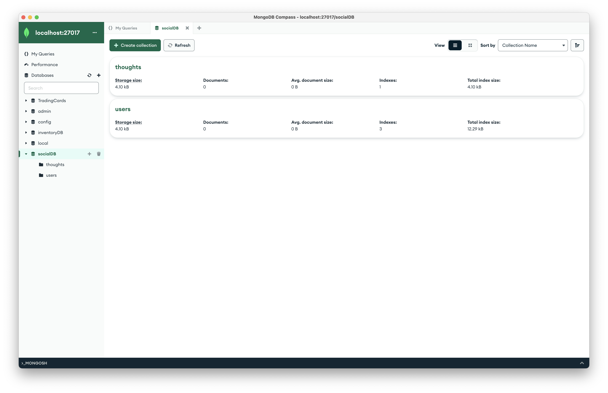
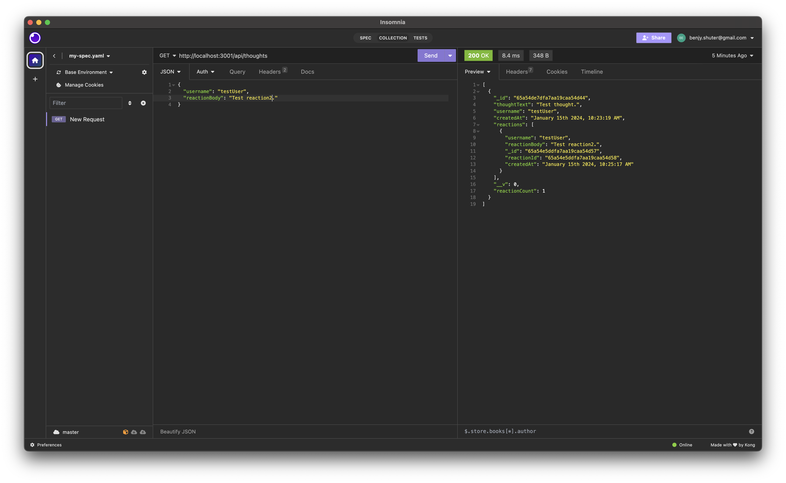

# social_network_api

## Description
A backend for a social network that allows users to create accounts, post thoughts, and react to thoughts.

## Installation
Requires NodeJS and MongoDB.

## Usage
Link database to mongodb through compass.  To start the server, use your terminal to navigate to the project folder.  Run the command, "npm run start".  Attach to front end if desired, by matching the api calls in the routes folder.

## Screenshots

## Video
[Walkthrough](https://drive.google.com/file/d/1tqP2fLL4VyZy9gFCZkGrik1jvGAIF7dL/view)